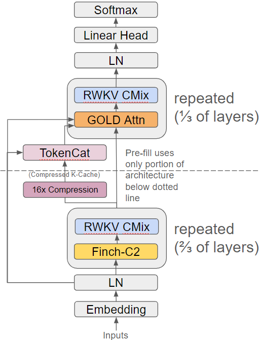
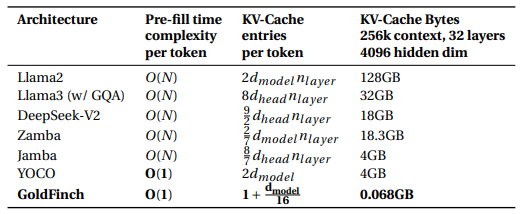
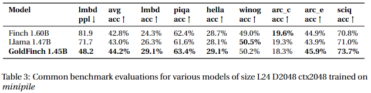
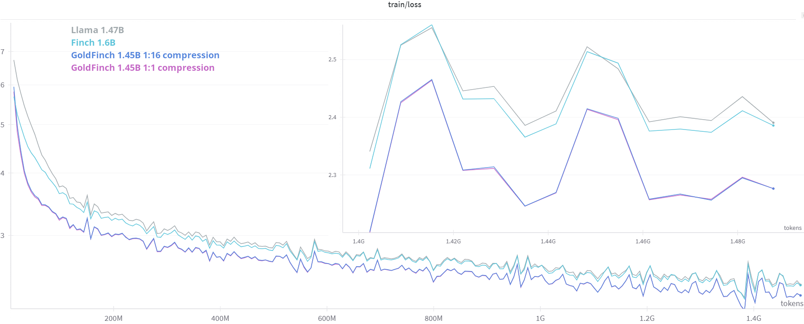

<div align="center" >
     

# GoldFinch 
## High Performance RWKV/Transformer Hybrid <br> with Linear Pre-Fill and Extreme KV-Cache Compression

Paper link: https://arxiv.org/abs/2407.12077 Checkpoints: https://huggingface.co/recursal/GoldFinch-paper

</div>

GoldFinch combines the best parts of Linear Attention (via RWKV) and traditional Transformers to create something that is better than either one on its own!

<div align="center" >
     
</div>

Two of the biggest problems that transformers face are the quadratic slowdown from softmax attention, and the size of their KV-Cache. GoldFinch eliminates that slowdown for pre-fill, and reduces the KV-Cache size to the point where you'll barely notice it's there:

<div align="center" >
     
</div>

This unlocks the potential for extremely large context lengths, without requiring large amounts of VRAM. Imagine putting in a whole codebase or stack of legal documents and asking questions about them. And if you happen to require only short answers you avoid most of the quadratic cost of attention. This is a major cost savings.

And the best part is that GoldFinch **outperforms** larger sized models of Llama and Finch (RWKV-6) on downstream tasks!

<div align="center" >
     
</div>

<div align="center" >
     
</div>

You get the ability to look back at every single token that came in like a full Transformer, but without all the costs and with better downstream performance.

We also provide the new Finch-C2, a higher downstream performance version of Finch (RWKV-6), and GPTAlpha, an enhanced full transformer architecture with RWKV components that uses softmax attention and outperforms traditional transformers.

Please see the GoldFinch paper at https://arxiv.org/abs/2407.12077 for more details.

## What's included in this repository

- Reconfigurable Transformer base model code with support for carried state
- Pluggable time and channel mixer component classes for several model architectures
  - GoldFinch
    - GOLD
    - Finch-C2 (RWKV-6-C2)
  - Eagle (RWKV-5)
  - Finch (RWKV-6)
  - GPTAlpha
  - Llama-like (no GQA)
- simple config system
- lightning based trainer
- lm_eval_harness support
- inference support (limited)

## setup

```
pip install lightning==2.3.0 torch deepspeed==0.14.3 wandb ninja --upgrade
```

you can download the minipile binidx via 

```bash 
mkdir -p data
wget --continue -O data/minipile.idx https://huggingface.co/datasets/BlinkDL/minipile-tokenized/resolve/main/rwkv_vocab_v20230424/minipile.idx
wget --continue -O data/minipile.bin https://huggingface.co/datasets/BlinkDL/minipile-tokenized/resolve/main/rwkv_vocab_v20230424/minipile.bin
```

support for validation sets has been added
to download the minipile validation set you'll need to run the supplied `get_minipile.py` and then obtain binidx conversion tool at https://github.com/BlinkDL/RWKV-LM/blob/main/RWKV-v5/make_data.py and run that

## configuration

new config system allows you to specify one or more `-c CONFIG_PATH` in yaml or json format
later configs will override earlier ones
you can also list specific config parameters e.g. `--model.n_layer 12 --train.lr_init: 6e-4`

see configs.py for specific configuration settings in dataclasses

model.tmix is the first variety of time mixer, becomes the class at path f'tmix.tmix_{tmix}.TMix_{tmix}'
model.tmix2 is the second variety of time mixer, if any
model.cmix is the first variety of channel mixer
model.cmix2 is the second variety of channel mixer, if any
model.inv_other_layer_ratio is the ratio of second variety layers to all layers (e.g. 3 means 2/3 of the first variety and 1/3 of the second variety)

## running it

to create the starting initial state for a model run prepare.py with --train.train_stage 1:
`python train.py -c configs/L12D768minipile.yaml -c configs/goldfinch.yaml --train.train_stage 1`

then to train the model:
`python train.py -c configs/L12D768minipile.yaml -c configs/goldfinch.yaml `

use `train.proj_dir`, `train.proj_name`, and `train.proj_suffix` to change dir from defaulting to something like `"out/" + "L12-D768-x060c2_gold" + "-0"`

beware, it will continue from any numbered saved checkpoints still in the directory (if running again in the same dir)

there is also some lm_eval support in run_lm_eval.py, which also uses the same config system

and dragon_test.py which can be used to run a quick inference test, also with the same system
